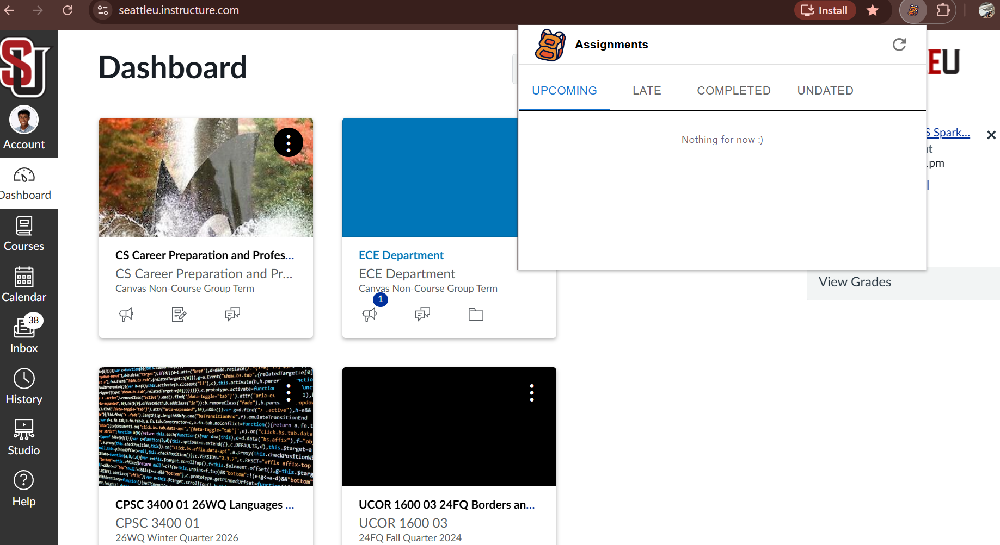
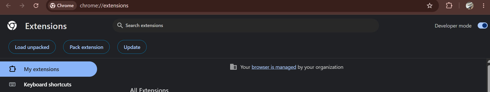

# Pretty Canvas

## A Chrome web extension for Seattle University college students that aggregates all relevant Canvas assignments onto a single dashboard. 

Isn't it annoying that all your Canvas assignments aren't just immediately located on a single, convenient place? To address this issue, I made Pretty Canvas. It is a Chrome web extension that utilizes a Canvas API to retrieve assignments, sort them within relevant categories, and then display via a React frontend. To save state, the implementation utilizes the chrome.storage.local API to cache current info, with new user assignment data being retrieved every 2 minutes.  

While my original intent was a website, I soon realized that the SeattleU Canvas admins don't expose any APIs, and thus browser CORs rules would foil any of my further plans for an independent web app. However, Chrome extensions possess a different security model, being "priviledged software", and fortunately bypass the CORs restrictions set upon normal websites. The user only needs to provide the proper permissions as listed in the 'manifest.json' file (this is completed during the process of downloading the extension).

## If you'd like the published version:

(Working on test cases currently, there'll be a valid link eventually!)

## If you'd like to edit / build the code yourself:
  
  1. Run 'npm run build'.

  2. On Chrome, go to 'chrome://extensions' and turn on 'Developer mode' 

  3. Finally, click on 'Load unpacked' and select the 'dist' folder (it should exist as a subfolder within this project directory)
